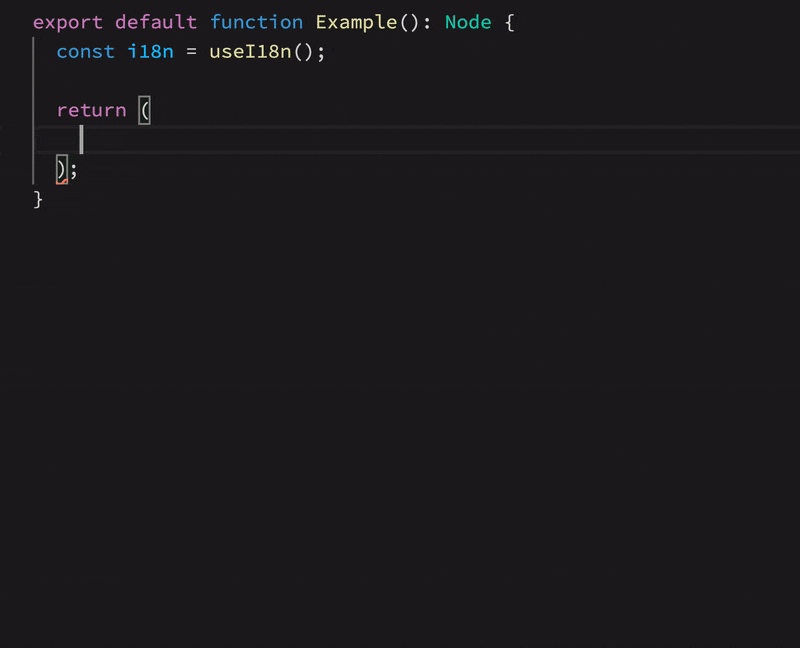

# VSCode Gestalt

Visual Studio Code extension for Gestalt, Pinterest's design system

## Features

### Snippets

- **List Gestalt components**
- **Required props** are included
- **Quick select** boolean & enum props



## Extension Settings

| Setting                   | Type (default)     | Description              |
| :------------------------ | :----------------- | :----------------------- |
| `gestalt.enableTelemetry` | `boolean` (`true`) | Enable/disable telemetry |

## Release Notes

See [Changelog](./CHANGELOG.md)

## Publish

Publish a new version:

1. Update `CHANGELOG.md` and add a new version
2. Publish with `vsce`

```
npm i -g vsce
vsce publish patch
```

## TODO

- React hooks support. Depends on https://github.com/reactjs/react-docgen/issues/332
- Change testing framework from `mocha` to `jest`: https://github.com/microsoft/vscode-extension-samples/pull/251/files

## FAQ

### How do the snippets work?

- Use [react-docgen](https://github.com/reactjs/react-docgen) to get required React props for every Gestalt component
- Generate the `snippets.json` file

### The extension doesn't seem to work, what can I do to debug?

1. Do not override `editor.quickSuggestions` in your user settings
2. Use VSCode >= 1.58.0

Then restart your editor and copy/paste the output in the `Gestalt` output log.
